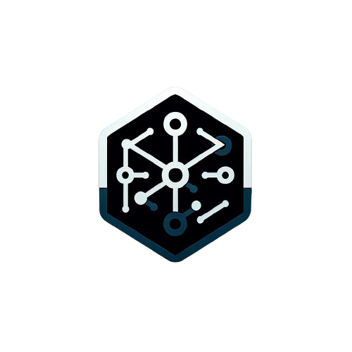
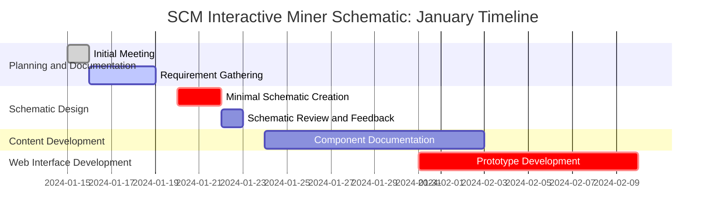
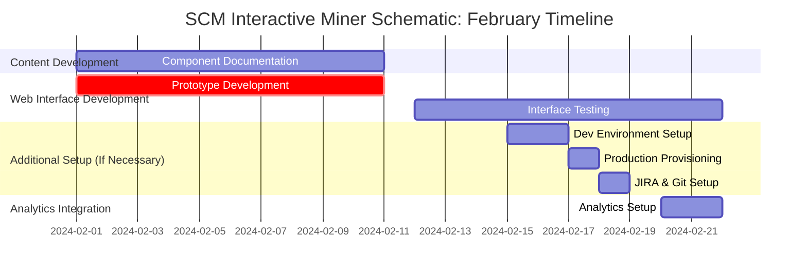
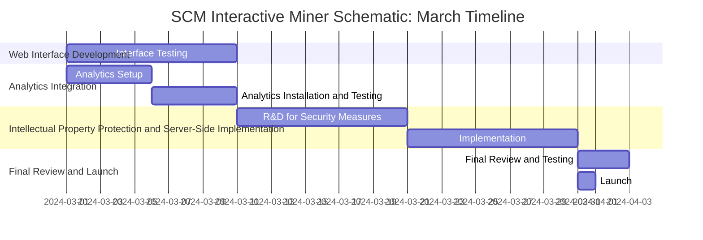
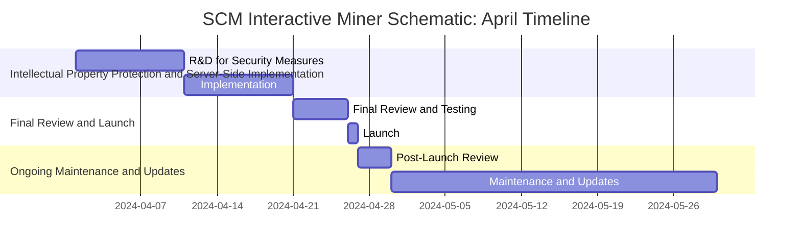
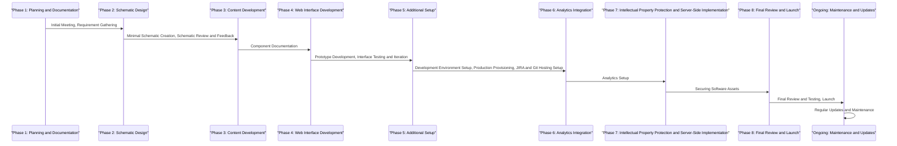
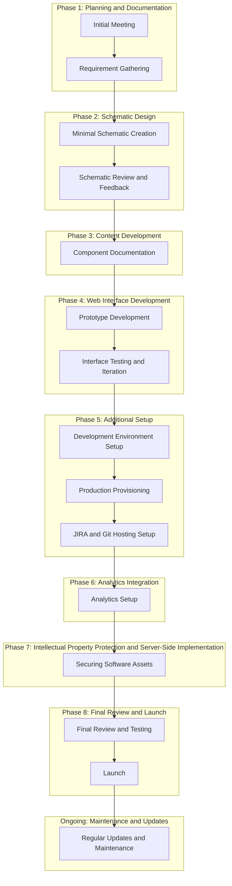
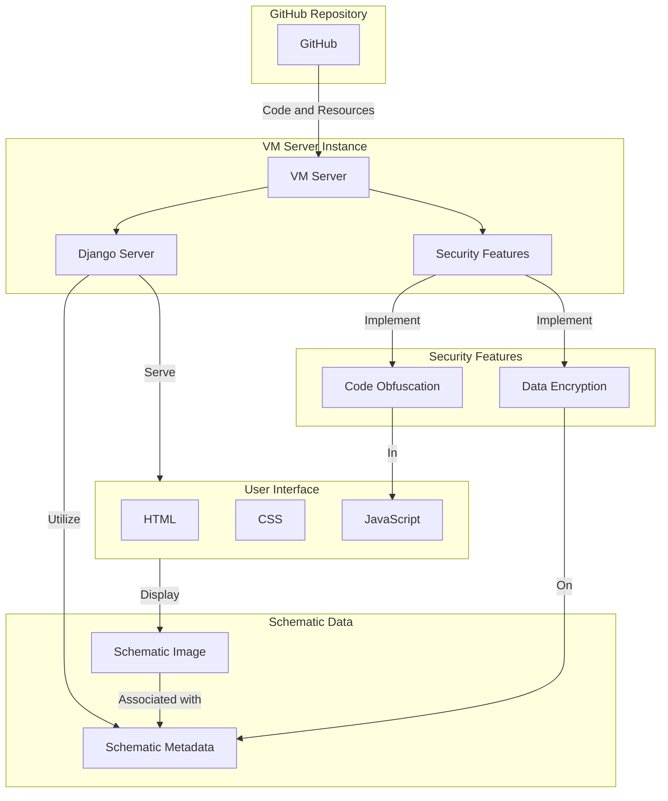

### SCM Interactive Miner Schematic
[Readme](README.md) |
[Charts](charts.md)
### Timelines / Gannt Charts
_(est.)_

```mermaid
gantt
    dateFormat  YYYY-MM-DD
    title SCM Interactive Miner Schematic: January Timeline

    section Planning and Documentation
    Initial Meeting :done, 2024-01-15, 1d
    Requirement Gathering :active, 2024-01-16, 3d

    section Schematic Design
    Minimal Schematic Creation :crit, 2024-01-20, 2d
    Schematic Review and Feedback : 2024-01-22, 1d

    section Content Development
    Component Documentation : 2024-01-24, 10d

    section Web Interface Development
    Prototype Development :crit, 2024-01-31, 10d
```

```mermaid
gantt
    dateFormat  YYYY-MM-DD
    title SCM Interactive Miner Schematic: February Timeline

    section Content Development
    Component Documentation : 2024-02-01, 10d

    section Web Interface Development
    Prototype Development :crit, 2024-02-01, 10d
    Interface Testing : 2024-02-12, 10d

    section Additional Setup (If Necessary)
    Dev Environment Setup : 2024-02-15, 2d
    Production Provisioning : 2024-02-17, 1d
    JIRA & Git Setup : 2024-02-18, 1d

    section Analytics Integration
    Analytics Setup : 2024-02-20, 2d
```

```mermaid
gantt
    dateFormat  YYYY-MM-DD
    title SCM Interactive Miner Schematic: March Timeline

    section Web Interface Development
    Interface Testing : 2024-03-01, 10d

    section Analytics Integration
    Analytics Setup : 2024-03-01, 5d
    Analytics Installation and Testing : 2024-03-06, 5d

    section Intellectual Property Protection and Server-Side Implementation
    R&D for Security Measures : 2024-03-11, 10d
    Implementation : 2024-03-21, 10d

    section Final Review and Launch
    Final Review and Testing : 2024-03-31, 3d
    Launch : 2024-03-31, 1d

```

```mermaid
gantt
    dateFormat  YYYY-MM-DD
    title SCM Interactive Miner Schematic: April Timeline

    section Intellectual Property Protection and Server-Side Implementation
    R&D for Security Measures : 2024-04-01, 10d
    Implementation : 2024-04-11, 10d

    section Final Review and Launch
    Final Review and Testing : 2024-04-21, 5d
    Launch : 2024-04-26, 1d

    section Ongoing Maintenance and Updates
    Post-Launch Review : 2024-04-27, 3d
    Maintenance and Updates :ongoing, 2024-04-30, 30d

```
### Sequence diagram

```mermaid
sequenceDiagram
    participant "Phase_1" as "Phase 1: Planning and Documentation"
    participant "Phase_2" as "Phase 2: Schematic Design"
    participant "Phase_3" as "Phase 3: Content Development"
    participant "Phase_4" as "Phase 4: Web Interface Development"
    participant "Phase_5" as "Phase 5: Additional Setup"
    participant "Phase_6" as "Phase 6: Analytics Integration"
    participant "Phase_7" as "Phase 7: Intellectual Property Protection and Server-Side Implementation"
    participant "Phase_8" as "Phase 8: Final Review and Launch"
    participant "Ongoing" as "Ongoing: Maintenance and Updates"

    "Phase_1"->>"Phase_2": Initial Meeting, Requirement Gathering
    "Phase_2"->>"Phase_3": Minimal Schematic Creation, Schematic Review and Feedback
    "Phase_3"->>"Phase_4": Component Documentation
    "Phase_4"->>"Phase_5": Prototype Development, Interface Testing and Iteration
    "Phase_5"->>"Phase_6": Development Environment Setup, Production Provisioning, JIRA and Git Hosting Setup
    "Phase_6"->>"Phase_7": Analytics Setup
    "Phase_7"->>"Phase_8": Securing Software Assets
    "Phase_8"->>"Ongoing": Final Review and Testing, Launch
    "Ongoing"->>"Ongoing": Regular Updates and Maintenance
```
### Flow chart

```mermaid
flowchart TB
    subgraph Phase_1 ["Phase 1: Planning and Documentation"]
    A["Initial Meeting"]
    B["Requirement Gathering"]
    end

    subgraph Phase_2 ["Phase 2: Schematic Design"]
    C["Minimal Schematic Creation"]
    D["Schematic Review and Feedback"]
    end

    subgraph Phase_3 ["Phase 3: Content Development"]
    E["Component Documentation"]
    end

    subgraph Phase_4 ["Phase 4: Web Interface Development"]
    F["Prototype Development"]
    G["Interface Testing and Iteration"]
    end

    subgraph Phase_5 ["Phase 5: Additional Setup"]
    H["Development Environment Setup"]
    I["Production Provisioning"]
    J["JIRA and Git Hosting Setup"]
    end

    subgraph Phase_6 ["Phase 6: Analytics Integration"]
    K["Analytics Setup"]
    end

    subgraph Phase_7 ["Phase 7: Intellectual Property Protection and Server-Side Implementation"]
    L["Securing Software Assets"]
    end

    subgraph Phase_8 ["Phase 8: Final Review and Launch"]
    M["Final Review and Testing"]
    N["Launch"]
    end

    subgraph Ongoing ["Ongoing: Maintenance and Updates"]
    O["Regular Updates and Maintenance"]
    end

    A --> B
    B --> C
    C --> D
    D --> E
    E --> F
    F --> G
    G --> H
    H --> I
    I --> J
    J --> K
    K --> L
    L --> M
    M --> N
    N --> O
```
### Components / UML

```mermaid
flowchart TB
    subgraph Repo ["GitHub Repository"]
    GH[GitHub]
    end

    subgraph Server ["VM Server Instance"]
    VM[VM Server]
    Django[Django Server]
    Security[Security Features]
    end

    subgraph UI ["User Interface"]
    HTML[HTML]
    CSS[CSS]
    JS[JavaScript]
    end

    subgraph Schematic_Data ["Schematic Data"]
    Image[Schematic Image]
    Metadata[Schematic Metadata]
    end

    subgraph Security_Features ["Security Features"]
    Obfuscation[Code Obfuscation]
    Encryption[Data Encryption]
    end

    GH -->|Code and Resources| VM
    VM --> Django
    Django -->|Serve| UI
    UI -->|Display| Image
    Image -->|Associated with| Metadata
    Django -->|Utilize| Metadata
    VM --> Security
    Security -->|Implement| Obfuscation
    Obfuscation -->|In| JS
    Security -->|Implement| Encryption
    Encryption -->|On| Metadata
```